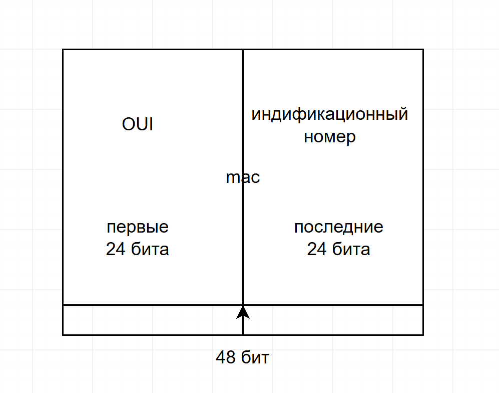
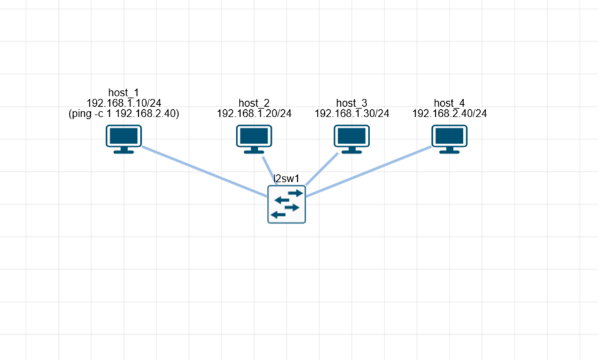
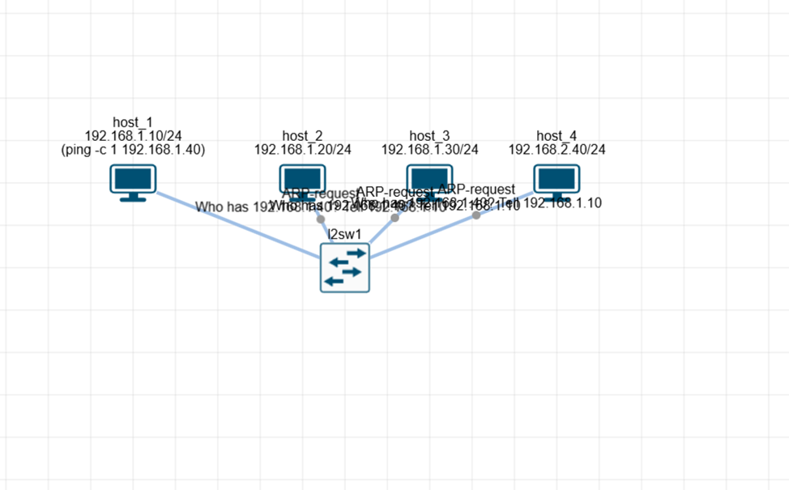

## Схема MAC-адреса
Честно я не очень понию что означет создать схему mac-адреса потому что он присвается уникалько к кадждой ситевой карте и состоит из кода производителя и уникального номера самой карты но я предположил как бы это выглядило

---

## Схема не рабочий сети

| Устройство | IP-адрес / Маска | Статус |
| :--- | :--- | :--- | :--- |
| host_1 | 192.168.1.10 / 24 | Отправитель |
| host_2 | 192.168.1.20 / 24 | Обычный узел|
| host_3 | 192.168.1.30 / 24 | Обычный узел|
| host_4 | 192.168.2.40 / 24 | Ошибка |

---

## Ошибка сети
Проблема: При команде ping 192.168.2.40 от host_1 к host_4 передается 0 пакетов. Связи нет.

Причина: Узлы находятся в разных подсетях (192.168.1.x и 192.168.2.x). Коммутатор передает данные только внутри одной подсети. Чтобы передать пакет в другую сеть, нужен маршрутизатор.

---

## Исправление ошибки
Чтобы устройства увидели друг друга, их нужно поместить в общую подсеть:
1. В настройках host_4 меняем ошибочный IP-адрес на правильный: 192.168.1.40.
2. В настройках host_1 обновляем команду на: ping 192.168.1.40.

